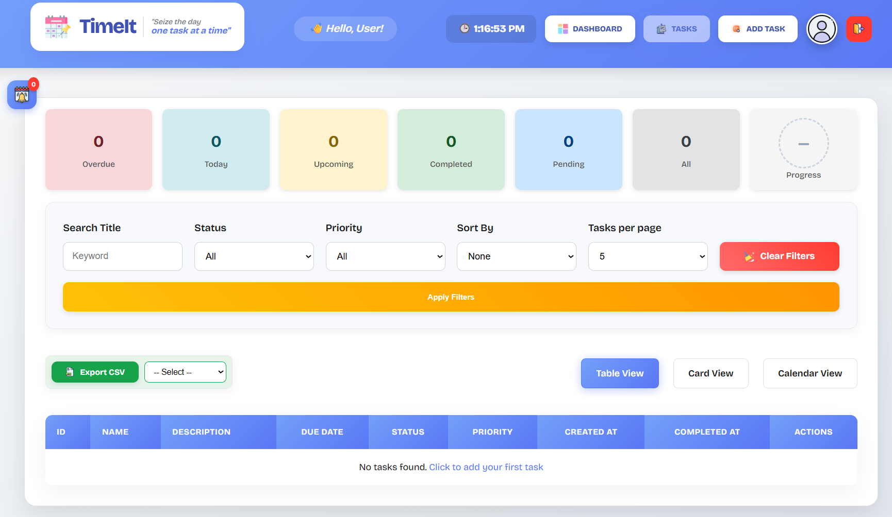

# 🗂️ Task Management Application


## 📌 Description

A simple and user-friendly **Task Management Web Application** built using **Spring Boot, Thymeleaf, and JavaScript**.

The application allows users to **add, edit, delete, and view tasks** using multiple layouts including **Table View, Card View, and Calendar View**.

---

## 📸 Screenshot



---

## 🚀 Features

- [x] Add new tasks
- [x] Edit existing tasks
- [x] Delete tasks
- [x] View tasks in table format
- [x] View tasks as cards
- [x] Calendar view using FullCalendar
- [x] Priority-based color coding
- [x] Success messages for add and edit actions

---

## 🛠️ Tech Stack

### Backend
- Java
- Spring Boot
- Spring MVC
- Spring Data JPA
- Hibernate

### Frontend
- HTML5
- CSS3
- JavaScript
- Thymeleaf

### Database
- MySQL / H2

### Libraries & Tools
- FullCalendar.js
- Google Fonts
- Flaticon

---

## 🔗 External References

- [FullCalendar](https://fullcalendar.io/)
- [Google Fonts](https://fonts.google.com/)
- [Flaticon](https://www.flaticon.com/)
- [Spring Boot Documentation](https://spring.io/projects/spring-boot)

---

## 📂 Project Structure

```text
task-manager/
├── src/main/java
│   └── com.example.taskmanager
│       ├── controller
│       ├── service
│       ├── repository
│       └── model
│
├── src/main/resources
│   ├── static
│   │   ├── css
│   │   └── js
│   └── templates
│       ├── tasks.html
│       ├── add-task.html
│       └── edit-task.html
│
└── application.properties

---

## How to run the Project

### Prerequisites
- Java JDK 17+
- Maven
- MySQL
- IntelliJ IDE

### Steps to run
1. Clone the repository
```bash
git clone https://github.com/your-username/task-manager.git
2. Open the project in an IDE.
3. Configure database in application.properties.
```bash
spring.datasource.url=jdbc:mysql://localhost:3306/taskdb
spring.datasource.username=root
spring.datasource.password=yourpassword
4. Run the application
```bash
mvn spring-boot:run
5. Open in browser
```bash
http://localhost:8080/api/tasks

---

## Application Flow
1. User adds a task
2. Task is saved in the database
3. Success message is displayed
4. User edits a task
5. Updated success message is shown
6. Tasks appear in calendar view automatically

---

## Future Enhancements
- User authentication
- Task reminders
- Search and filter options
- Mobile-friendly UI
- Cloud deployment

---

## Author
### Archita Porov
