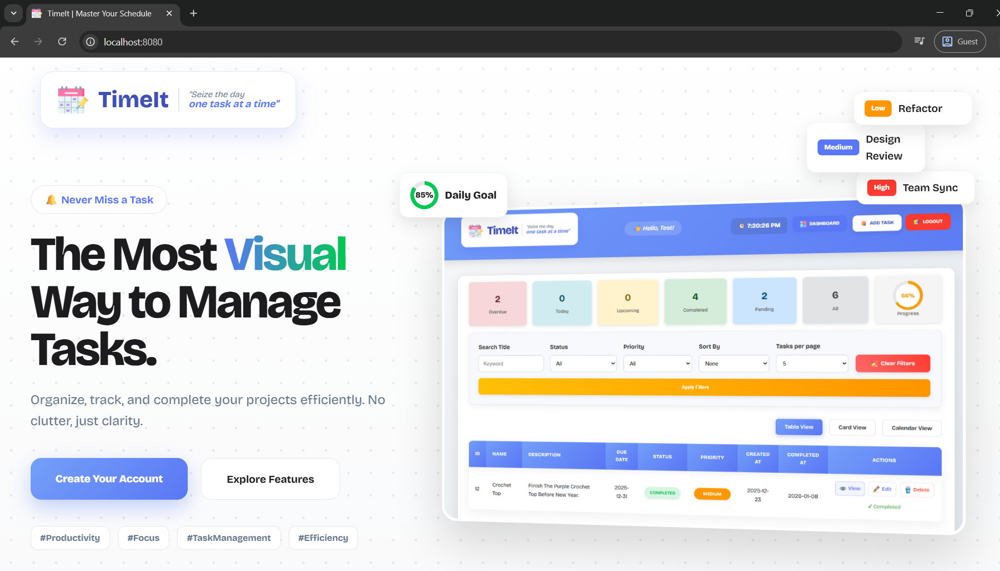

# 🗂️ TimeIt — Smart Task Reminder & Productivity App


## 📌 Description

**TimeIt** is a **full-featured Java Spring Boot task management and reminder web application** designed to help users organize tasks, track priorities, and never miss deadlines.

The application supports **secure user authentication**, **background schedulers for email reminders**, and **advanced task search & filtering**, making it a complete, production-ready productivity solution.

---

## 📸 Screenshot




---

## 🚀 Features

- [x] Secure user authentication (Spring Security)
- [x] OTP-based email verification & password reset
- [x] Add, edit, delete tasks
- [x] Task search and advanced filtering
- [x] Priority-based color coding
- [x] Calendar view (FullCalendar)
- [x] Automated email reminders using scheduler
- [x] Success & error notifications
- [x] Responsive UI

---

## 🏗️ Application Architecture

```text
   ┌──────────────┐
   │   Browser    │
   │ Thymeleaf UI │
   └──────┬───────┘
          ▼
┌──────────────────────┐
│ Spring MVC Controller│
└─────────┬────────────┘
          ▼
┌──────────────────────┐
│    Service Layer     │
│    Business Logic    │
└─────────┬────────────┘
          ▼
┌──────────────────────┐
│   Repository Layer   │
│   Spring Data JPA    │
└─────────┬────────────┘
          ▼
┌──────────────────────┐
│    MySQL Database    │
└─────────┬────────────┘
          ▼
┌──────────────────────┐
│   Spring Scheduler   │
│   Email Reminders    │
└─────────┬────────────┘
          ▼
┌──────────────────────┐
│   SMTP Mail Server   │
└──────────────────────┘
```
---

## 🛠️ Tech Stack

### Backend
- Java 17+
- Spring Boot
- Spring MVC
- Spring Data JPA
- Spring Security
- Hibernate
- Spring Scheduler

### Frontend
- HTML5
- CSS3
- JavaScript
- Thymeleaf

### Database
- MySQL
- H2 (for development/testing)

### Libraries & Tools
- FullCalendar.js
- JavaMailSender
- Google Fonts
- Flaticon
- Maven

---

## 🔗 External References

- [Spring Boot](https://spring.io/projects/spring-boot)
- [FullCalendar](https://fullcalendar.io/)
- [Thymeleaf](https://www.thymeleaf.org/)
- [Google Fonts](https://fonts.google.com/)
- [Flaticon](https://www.flaticon.com/)

---

## 📂 Project Structure

```text
app/
├── src/main/java
│   └── com.taskreminder.app
│       ├── config
│       ├── controller
│       ├── service
│       ├── scheduler
│       ├── dto
│       ├── enums
│       ├── repository
│       └── entity
│
├── src/main/resources
│   ├── static
│   │   ├── css
│   │   └── js
│   └── templates
│       └── fragments
│       │    ├── header.html
│       │    └── footer.html
│       ├── index.html
│       ├── dashboard.html
│       ├── register.html
│       ├── forgot-password.html
│       ├── reset-password.html
│       ├── login.html
│       ├── verify-reset-otp.html
│       ├── verify-otp.html
│       ├── profile.html
│       ├── profile-edit.html
│       ├── tasks.html
│       ├── add-task.html
│       └── update-task.html
│
└── application.properties
```
---

## How to run the Project

### Prerequisites
- Java JDK 17+
- Maven
- MySQL
- IntelliJ IDEA

### Steps to run
1. Clone the repository
```bash
git clone https://github.com/ArchieP27/TaskReminderApp.git
```
2. Open the project in an IDE.
3. Configure database in application.properties.
```bash
spring.datasource.url=jdbc:mysql://localhost:3306/task_app
spring.datasource.username=root
spring.datasource.password=yourpassword
```
4. Run the application
```bash
mvn spring-boot:run
```
5. Open in browser
```bash
http://localhost:8080/
```

---

## Application Flow
1. User registers and verifies email via OTP 
2. User logs in securely 
3. User creates and manages tasks 
4. Scheduler checks upcoming deadlines 
5. Email reminders are sent automatically 
6. Tasks update live in table & calendar views

---

## Future Enhancements
- Push notifications 
- Recurring tasks 
- Task sharing & collaboration 
- Role-based access control 
- Cloud deployment (AWS / Azure)
- Mobile application

---

## 📄 Project Summary

• Built a production-ready task reminder application using Spring Boot and Thymeleaf.  
• Implemented secure authentication with Spring Security and OTP-based email verification.  
• Designed a scheduler-driven email notification system for task reminders.  
• Added advanced search, filtering, and calendar-based task visualization.

---

## Attribution

- See [CREDITS.md](CREDITS.md) for icon attributions.

---
## Author
### Archita Porov
